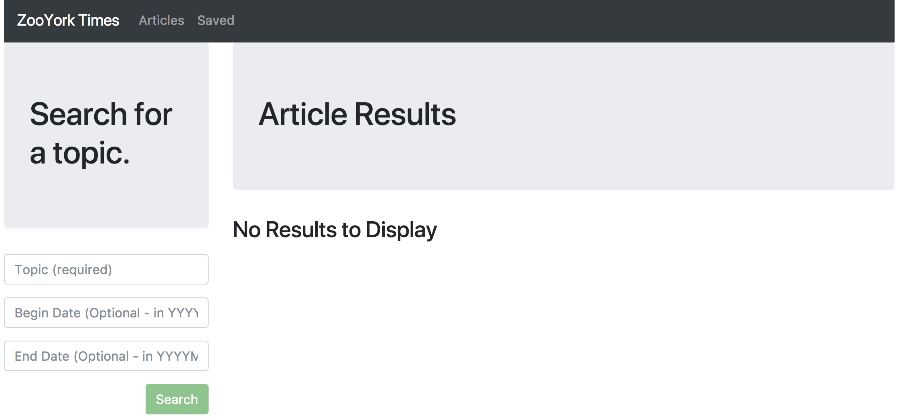

# ZooYorkTimes Scraper :newspaper::apple::statue_of_liberty:
A `NodeJS`, `MongoDB`, `Express`, and `ReactJS` application where users can query, display, and save articles from the [New York Times Article Search API](http://developer.nytimes.com/). Users can remove saved articles as well.

**Live Demo**: https://zooyorktimes-scraper.herokuapp.com/



Click on the headlines to be re-directed to the full New York Times articles.

## Functionality
On the backend, the app uses `express` to serve routes and `mongoose` to interact with a `MongoDB` database.

On the frontend, the app uses `ReactJS` for rendering components, `axios` for internal/external API calls, and `bootstrap` as a styling framework.

In order to transpile the JSX code, `webpack` and `babel` were utilized. All of the JSX  code in the `/app` folder was transpiled into the `bundle.js` file located in the `/public` folder.

## New York Times API
Prior to starting this app and getting an `unnecessary` error message, you'll probably want to swap out the API Key provided in the `client/src/utils/API.js` file. 

To get a New York Times API Key, visit [this link](https://developer.nytimes.com/signup).

## Quickstart

```
  git clone git@github.com:wrainaud/ZooYorkTimes-Scraper.git my-app
  cd my-app
  yarn install
  cd client
  yarn install
  cd ..
  yarn start
  # API server will listen on http://localhost:3002 by default
```

## Quickstop

```
  ^C
  ^C
```

**Note : Please make sure your MongoDB is running.** For MongoDB installation guide see [this](https://docs.mongodb.org/v3.0/installation/). 
Run the following command in Terminal to start MongoDB after installation
```
  brew services start mongodb-community@4.4
```

Run the following command in Terminal to stop MongoDB
```
  brew services stop mongodb-community@4.4
```

Also `npm3` is required to install dependencies properly.

Troubleshooting
---------------
- Mongo connection error ECONNREFUSED: Make sure MongoDB is running (see commands above). By default the app connects to mongodb://127.0.0.1:27017/nytreact. You can override this via the MONGODB_URI environment variable.
- API returns 503 Database unavailable: This means MongoDB is not connected. Start Mongo or set MONGODB_URI to a reachable instance; the API will serve static assets and other routes meanwhile.
- Client error "No such module: http_parser": Modern Node versions (>=20) removed the legacy `http_parser` native binding required by very old webpack-dev-server versions used by CRA 1.x. To keep dev startup working on modern Node, this project’s start script now builds the React app (npm run build) and serves static assets from Express instead of running the legacy dev server.
- Something is already running on port 3000: The React development server defaults to port 3000. Stop any process using that port or set a different port before starting the client, e.g. PORT=3002 yarn start. The provided start script defaults the client to 3002 if PORT is not set.
- Mongoose module errors like "Cannot find module './types/embedded'" or deprecation warnings for `open()` usually indicate mixed or stale installs. Fix by removing top-level node_modules and client/node_modules, then reinstall: `rm -rf node_modules client/node_modules && yarn install && (cd client && yarn install)`.

Support
-------

Please [open an issue](https://github.com/wrainaud/ZooYorkTimes-Scraper/new) for support.

Contributing
-------

Please contribute using [Github Flow](https://guides.github.com/introduction/flow/). Create a branch, add commits, and [open a pull request](https://github.com/wrainaud/ZooYorkTimes-Scraper/compare/).

License
-------

The MIT License (MIT)

Copyright (c) 2017-2021 William J. Rainaud

Permission is hereby granted, free of charge, to any person obtaining a copy of this software and associated documentation files (the "Software"), to deal in the Software without restriction, including without limitation the rights to use, copy, modify, merge, publish, distribute, sublicense, and/or sell copies of the Software, and to permit persons to whom the Software is furnished to do so, subject to the following conditions:

The above copyright notice and this permission notice shall be included in all copies or substantial portions of the Software.

THE SOFTWARE IS PROVIDED "AS IS", WITHOUT WARRANTY OF ANY KIND, EXPRESS OR IMPLIED, INCLUDING BUT NOT LIMITED TO THE WARRANTIES OF MERCHANTABILITY, FITNESS FOR A PARTICULAR PURPOSE AND NONINFRINGEMENT. IN NO EVENT SHALL THE AUTHORS OR COPYRIGHT HOLDERS BE LIABLE FOR ANY CLAIM, DAMAGES OR OTHER LIABILITY, WHETHER IN AN ACTION OF CONTRACT, TORT OR OTHERWISE, ARISING FROM, OUT OF OR IN CONNECTION WITH THE SOFTWARE OR THE USE OR OTHER DEALINGS IN THE SOFTWARE.  
