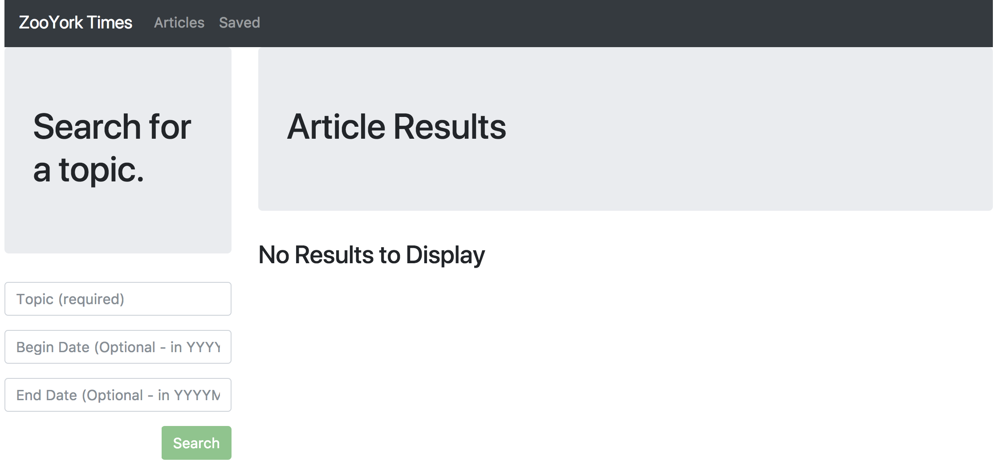

# ZooYorkTimes Scraper :newspaper::apple::statue_of_liberty:
A `NodeJS`, `MongoDB`, `Express`, and `ReactJS` application where users can query, display, and save articles from the [New York Times Article Search API](http://developer.nytimes.com/). Users can remove saved articles as well.

**Live Demo**: [Coming soon on Replit]



Click on the headlines to be re-directed to the full New York Times articles.

## Functionality
On the backend, the app uses `express` to serve routes and `mongoose` to interact with a `MongoDB` database.

On the frontend, the app uses `ReactJS` for rendering components, `axios` for internal/external API calls, and `bootstrap` as a styling framework.

In order to transpile the JSX code, `webpack` and `babel` were utilized. All of the JSX  code in the `/app` folder was transpiled into the `bundle.js` file located in the `/public` folder.

## Report Generation
You can generate a report of all saved articles by accessing the `/api/saved/report` endpoint.

### CSV Report (default)
```
GET /api/saved/report
```
Returns a downloadable CSV file with columns: Title, URL, Date.

### JSON Report
```
GET /api/saved/report?format=json
```
Returns a JSON object with the following structure:
```json
{
  "generatedAt": "2024-01-15T12:00:00.000Z",
  "totalArticles": 5,
  "articles": [
    {
      "title": "Article Title",
      "url": "https://example.com/article",
      "date": "2024-01-15T00:00:00.000Z"
    }
  ]
}
```

## New York Times API
To use the app, set your NYT Article Search API key in an environment file instead of editing source code.

1. Get an API key: https://developer.nytimes.com/signup
2. Create a file at `client/.env` with the following content:

```
REACT_APP_NYT_API_KEY=YOUR_NYT_API_KEY_HERE
```

3. Start the app (`npm run dev`). The client build will read the env var at build time. If you change the key, rebuild the client.

## Quickstart

```
  git clone git@github.com:wrainaud/ZooYorkTimes-Scraper.git my-app
  cd my-app
  npm install
  npm run dev
  # API server will listen on http://localhost:3003 by default
```

## Deployment

This app is configured for easy deployment on **Replit**.

1. Create a free account on [Replit](https://replit.com/).
2. Create a new Repl and import this GitHub repository.
3. Replit will detect the configuration or you can set the Run button to `npm run build && npm start`.
4. In the Replit **Secrets** (Environment Variables) tab, add:
   - `REACT_APP_NYT_API_KEY`: Your New York Times API Key.
   - `MONGODB_URI`: Your MongoDB connection string (e.g., from [MongoDB Atlas](https://www.mongodb.com/cloud/atlas)).
5. Click the **Run** button to build and start your app. It will be available at a custom `.replit.app` URL.

## Quickstop

```
  ^C
  ^C
```

**Note : Please make sure your MongoDB is running.** For MongoDB installation guide see [this](https://www.mongodb.com/docs/manual/installation/).

Tested with MongoDB 5.0–7.0. If you're on macOS with Homebrew, you can use:

Run the following command in Terminal to start MongoDB after installation
```
  brew services start mongodb-community@7.0
```

Run the following command in Terminal to stop MongoDB
```
  brew services stop mongodb-community@7.0
```

Troubleshooting
---------------
- Mongo connection error ECONNREFUSED: Make sure MongoDB is running (see commands above). By default the app connects to mongodb://127.0.0.1:27017/nytreact. You can override this via the MONGODB_URI environment variable.
- API returns 503 Database unavailable: This means MongoDB is not connected. Start Mongo or set MONGODB_URI to a reachable instance; the API will serve static assets and other routes meanwhile.
- Client error "No such module: http_parser": Modern Node versions (>=20) removed the legacy `http_parser` native binding required by very old webpack-dev-server versions used by CRA 1.x. To keep dev startup working on modern Node, this project’s start script now builds the React app (npm run build) and serves static assets from Express instead of running the legacy dev server.
- Something is already running on port 3000: The React development server defaults to port 3000. Stop any process using that port or set a different port before starting the client, e.g. PORT=3003 npm run dev. The provided start script defaults the client to 3003 if PORT is not set.
- Mongoose module errors like "Cannot find module './types/embedded'" or deprecation warnings for `open()` usually indicate mixed or stale installs. Fix by removing top-level node_modules and client/node_modules, then reinstall: `rm -rf node_modules client/node_modules && npm install && (cd client && npm install)`.

Support
-------

Please [open an issue](https://github.com/wrainaud/ZooYorkTimes-Scraper/new) for support.

Contributing
-------

Please contribute using [Github Flow](https://guides.github.com/introduction/flow/). Create a branch, add commits, and [open a pull request](https://github.com/wrainaud/ZooYorkTimes-Scraper/compare/).

License
-------

This project is licensed under the GNU Affero General Public License v3.0 (AGPL-3.0). See the LICENSE file for details.

Copyright (c) 2017–2025 William J. Rainaud.
